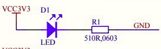
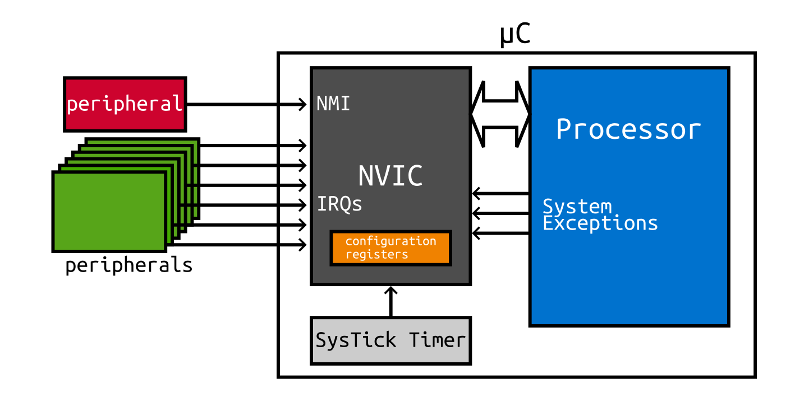

# STM32F103C8T6 baremetal

El código alojado en este repositorio se emplea como base para desarrollar proyectos de software *baremetal*, escritos desde cero en lenguaje arm, bajo la sintaxis del GNU Assembler (GAS). El término «programación *baremetal*» hace referencia al hecho de desarrollar programas que serán ejecutados en un microcontrolador (µC) sin asistencia de un sistema operativo u otra capa de software que abstraiga la complejidad del hardware. Este tipo de programación se emplea para desarrollar aplicaciones de alto rendimiento que aprovechan al máximo los limitados recursos de cómputo propios de un µC. 

Académicamente, la programación *baremetal* permite que los estudiantes adquieran conocimientos profundos sobre la arquitectura del µC, entendiendo el término «arquitectura» como «*las relaciones estructurales que no son visibles al programador* [de lenguajes de alto nivel de abstracción], *tales como interfaces a los periféricos* [y sus registros de configuración], *la frecuencia del reloj o la tecnología usada por la memoria*» (Murdocca, 2007). Además, este tipo de programación permite experimentar directamente con el proceso de ensamble y enlace, los cuales se ven oscurecidos al compilar código escrito en C, por ejemplo.

El proceso de ensamble es aquel que consiste en traducir código arm en código máquina. Este código tiene la particularidad de tener una longitud de 16 bits porque está codificado según el conjunto `Thumb`. Este código tiene la ventaja de requerir poco espacio de almacenamiento.

El enlace es el proceso que consiste en unir el código máquina contenido en diferentes objetos para crear un programa ejecutable. El programa que realiza el
enlace se llama enlazador. El enlace puede ser estático o dinámico y resulta en un archivo ELF que indica cómo el código máquina debe almacenarse en la memoria de instrucciones o en la memoria de datos.

## Motivación

Esta plantilla de proyecto es necesaria porque mucha de la documentación sobre ARM se presenta siguiendo la sintaxis propia del ensamblador privado (ARM assembly syntax) y no en GAS. Asimismo, existen muchos recursos virtuales en la web que permiten comenzar un proyecto de software, pero estos se codifican en C empleando la capa de abstracción de hardware de STM32 bajo un entorno de desarrollo integrado (IDE) como el STM32CubeIDE que ofrece todos los archivos necesarios para poder compilar, ensamblar y escribir un µC STM32. Estos recursos disponibles son de alto valor; sin embargo, no cubren la necesidad de aquellos que requieren comenzar un proyecto de software para un µC empleando herramientas de compilación libres.

En el libro «Embedded Systems with ARM Cortex-M Microcontrollers in Assembly Language and C» (Zhi, 2018) se explican diversos fragmentos de código, todos estos escritos con la sintaxis propia de ARM. En el apéndice A del libro antes referenciado se encuentra una explicación útil sobre similitudes entre la sintaxis del GAS y del ensamblador ARM. No obstante, esta explicación puede no ser suficiente para que un principiante que está comenzando a comprender la relación entre el lenguaje ensamblador y la arquitectura de los µC arm Cortex-M3 pueda comenzar un proyecto *baremetal* por su cuenta.

En GitHub y en Youtube se encuentran recursos que pueden emplearse para comenzar un proyecto de software *baremetal*. El código publicado en el repositorio stm32-asm-samples en por el usuario @lapers se emplea como base la generación de esta plantilla de proyecto. Además, el *script* de configuración del enlazador está basado en el código presentado en video «Bare metal embedded lecture-4: Writing linker scripts and section placement», publicado el canal FastBit Embedded Brain Academy.

## Descripción de los archivos del proyecto

Los archivos que componen la platilla de proyecto de programación *baremetal* se describen enseguida. 

Los archivos con extensión INC contienen mnemónicos de direcciones de memoria que sustituyen la dirección base de alguna sección de algún periférico o la compensación (*offset*) que debe sumarse a la dirección base para alcanzar algún registro de configuración en particular.

Los archivos con extensión S contienen código ensamblador ARM escrito en sintaxis GAS. Todas las funciones contenidas en estos archivos son declaradas como globales para que éstas puedan ser visibles por otros funciones contenidas en otros archivos durante el proceso de enlace.:

### main.s

La función `__main` está contenida en este archivo. Por omisión, está función siempre es invocada por la subrutina de restablecimiento. El código ensamblador de la función `__main` configura el pin trece de la tarjeta *blue pill* para que se encienda y apague cada segundo. A este comportamiento de encendido y apagado intermitente se le conoce como parpadeo (*blink*).

El pin trece de la tarjeta *blue pill* tiene conectado un led azul, como se muestra en la figura de abajo. Este led está conectado en modo ánodo, lo que implica que éste se enciende si se escribe el bit trece del registro `GPIOC_ODR` con cero. Para lograr que el led parpadee, el valor del bit trece se complementa cada segundo, aproximadamente, mediante un bucle que genera el retraso mencionado.



### default_handler.s

La rutina de servicio de interrupción de restablecimiento se encuentra alojada en este archivo. Esta rutina se invoca cada que el µC se restablece. Su código debe extenderse para inicializar las localidades de memoria de la sección de datos, la cual aloja las variables estáticas declaradas en lenguajes de alto nivel. Este inicialización se realiza mediante un bucle *for* que copia byte a byte el valor inicial de las variables estáticas o las variables globales a la SRAM. la subrutina de restablecimiento también puede inicializar en cero aquellas variables estáticas que corresponden a la sección BSS (*block started by symbol*).

En lenguaje C, el gestionador de restablecimiento se codifica de la siguiente manera. Si el usuario de la plantilla desea inicializar variables globales o estáticas, entonces debe compilar el código en C a arm según corresponda (o solicitar a una IA que produzca el código en el lenguaje ensamblador en cuestión). Se debe tener en cuenta que las variables que inician con un guion bajo corresponden a símbolos en ensamblador cuyo valor es establecido por el enlazador. 

```C
// Reset handler
void Reset_Handler(void)
{
    uint32_t *src, *dst;

    // Copies the data section from flash to RAM
    src = &_la_data;
    dst = &_sdata;
    while (dst < &_edata) {
        *dst++ = *src++;
    }

    // Clears the bss section in RAM
    dst = &_bss;
    while (dst < &_ebss) {
        *dst++ = 0;
    }

    // Calls main
    main();

    // If main returns, enters an infinite loop
    while (1);
}
```

### Archivos INC

Estos archivo contiene directivas de ensamble que asignan un alias a la dirección base y a las compensaciones de los registros que permiten configurar los periféricos del µC. Los alias se establecen con la directiva de ensamble `.equ`, la cual asocia una etiqueta a un número.

Para configurar un periférico del µC, en primera instancia debe cargarse la dirección base del periférico a configurar, después, debe moverse la constante de configuración de a un registro y, finalmente, el valor del registro debe almacenarse en la dirección de memoria que resulta de la suma de la dirección base del periférico más la compensación para acceder al registro de configuración.

El siguiente recorte de código arm ejemplifica cómo habilitar el reloj en el puerto A. En este ejemplo se utiliza el alias `RCC_BASE`, definido en el archivo `rcc_map.inc`, para guardar la dirección base de los registros de configuración del reloj en lugar de la constante `0x40021000`. Para escribir la constante de configuración `0x00000004` en el registro `RCC_APB2ENR`, se utiliza la instrucción `str` sumando a la dirección base almacenada en el registro `r0` la compensación `RCC_APB2ENR_OFFSET`.

```ARM
    # enabling clock in port A
    ldr     r0, =RCC_BASE
    mov     r1, 0x4 @ loads 4 in r1 to enable clock in port A (IOPA bit)
    str     r1, [r0, RCC_APB2ENR_OFFSET] @ M[RCC_APB2ENR] gets 4
```

El archivo `afio_map.inc` contiene las directivas que relacionan la dirección base y las compensaciones de los registros de configuración de las funciones alternas de entrada y salida (AFIO, *Alternate Function Input/Output*). Entre varias utilidades, los registros AFIO permite configurar las interrupciones externas.

Los alias que corresponden a la dirección de memoria base y las compensaciones de los registros de configuración de las interrupciones externas están contenidas en el archivo `exti_map.inc`. Una interrupción externa es aquella que es disparada por una señal generada por un periférico externo al µC, por ejemplo, el cambio de voltaje generado al oprimir un botón. La *blue pill* puede atender hasta 16 interrupciones externas. Las interrupciones externas de la cero a la cuatro están asociadas a su propia ISR, mientas que las interrupciones de en los rangos [9, 5] y [15, 10] se atienden mediante la misma ISR cada una.

Los procesadores de la familia Cortex-M3 disponen de un controlador llamado NVIC (*nested vectorized interrupt controller*). Este controlador se encarga de gestionar las interrupciones generadas por periféricos externos conectados al procesador. En la siguiente figura de muestra un esquema que ilustra la conexión de los periféricos externos y el controlador, así como la conexión del procesador con el controlador. 



Dependiendo del modelo del procesador Cortex-M, este controlador puede atender hasta 240 tipos de interrupciones. El archivo `nvic_reg_map.inc` contiene los alias de la dirección base y las compensaciones de los registros de configuración de este controlador.

El periférico que se encarga de sistema de reinicio y configuración del reloj de los procesadores Cortex-M se denota con las siglas RCC (*Reset and Clock Control*). Dependiendo de la configuración de este periférico, es posible habilitar o deshabilitar el reloj del sistema y seleccionar la señal de reloj de cada periférico del microcontrolador. Los alias que facilitan la manipulación de las direcciones de los registros de configuración del periférico RCC se encuentran definidos en el archivo `rcc_map.inc`.

El periférico SCB (*System Control Block*) habilita varias funciones del µC, entre las que se encuentra la gestión de la prioridad de las interrupciones y el manejo de excepciones del sistema. Este periférico también configura el manejo de las fallas del sistema y las características de depuración. Las etiquetas asociadas a la dirección base y las compensaciones necesarias acceder a los registros de configuración de este periférico están contenidas en el archivo `scb_map.inc`.

El temporizador del sistema (*SysTick*) es un contador de 24 bits que genera una excepción cada que la cuenta llega a cero y se reinicia. Este temporizador puede trabajar con la frecuencia base de la placa *blue pill* o con está frecuencia dividida entre ocho. El archivo `systick_map.inc` contiene los alias de la dirección base y las compensaciones que permiten acceder a los registros de configuración de este periférico.

## Software requerido

En sistemas basado en Ubuntu, debes emitir el siguiente comando para realizar la instalación del compilador cruzado arm y la utilidad para grabar archivos BIN en la memoria de los µC del fabricante STM.

```Bash
$ sudo apt install stlink-tools gcc-arm-none-eabi make
```

Bajo windows, es necesario instalar el compilador cruzado en alguna distribución que se ejecute sobre el WSL (*Windows Subsystem for Linux*), si es que se dispone de este. Desafortunadamente, el acceso a los puertos USB bajo el WSL es complicado. En su lugar, es recomendable emplear la herramienta gráfica  [STM32CubeProgrammer](https://www.st.com/en/development-tools/stm32cubeprog.html) o instalar manualmente las herramientas en cuestión, esto último puede realizarse siguiendo las instrucciones descritas en el siguiente repositorio [st-tools](https://github.com/stlink-org/stlink).

Si no se dispone del WSL, entonces es posible instalar el compilador cruzado mediante la terminal MSYS64 provista por el ambiente de programación minGW. De igual forma, la grabación de µC se realizaría con el programa [STM32CubeProgrammer](https://www.st.com/en/development-tools/stm32cubeprog.html) o con el software publicado en [st-tools](https://github.com/stlink-org/stlink).

```Bash
$ pacman -S mingw-w64-x86_64-arm-none-eabi-gcc mingw-w64-make
```

## Utilización de la plantilla de proyecto

Si estás clonando el código desde github, entonces conviene desvincular tu copia local del repositorio remoto. Para esto, en la terminal de comandos, dentro de la carpeta que aloja la plantilla de proyecto, emite el siguiente comando `make unlink`.

Enseguida, limpia el proyecto ejecutando el comando `make clean`. Este comando elimina los archivos objeto que resultan del ensamble del código arm, así como los archivo ELF y BIN. Utiliza este comando siempre y cuando desees preservar únicamente los archivos fuente. Si estás codificando desde Windows, entonces emplea el comando `make cleanwin`, el cual tiene el mismo efecto que el ya descrito en este párrafo.

Antes de ensamblar los archivos S, es necesario que agregues a la línea 10 del archivo `Makefile` aquellos archivos que contengan el código de las funciones que has escrito, por ejemplo, podrías agregar a la lista el archivo `delay.s` en caso de que lo hubieras codificado.

Una vez que has completado la lista de archivos S a ensamblar, ejecuta el comando `make`, el cual creará los archivos objetos que corresponden a tus archivos S y los enlazará según las reglas descritas en el archivo `stm32f103c8t6.ld`, esto si no hay errores en el código. Después, el mismo `make` genera el archivo BIN que puede grabarse en el µC.

El archivo BIN contiene el código que el µC ejecutará, el valor de las variables estáticas o globales y los arreglos inicializados que serán cargadas en la memoria del µC. Si deseas escribir este código mediante la terminal, entonces emite el comando `make write`, el cual invoca a la utilidad `st-flash` para grabar el archivo `prog.bin` generado por el comando `make`. Recuerda que `make write` solo opera correctamente en Linux.